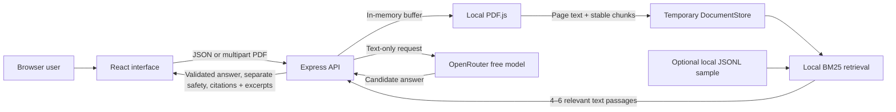
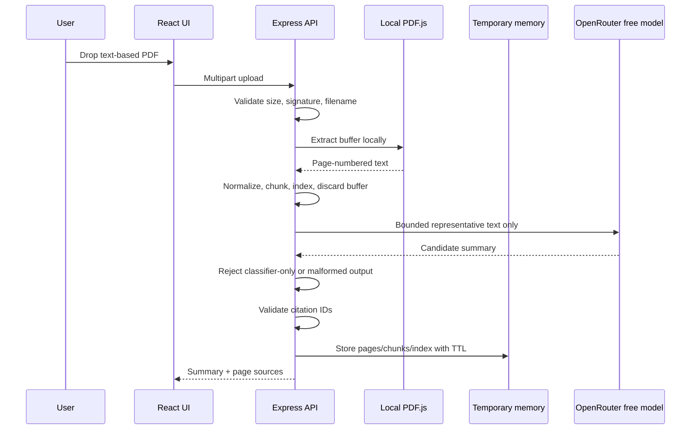
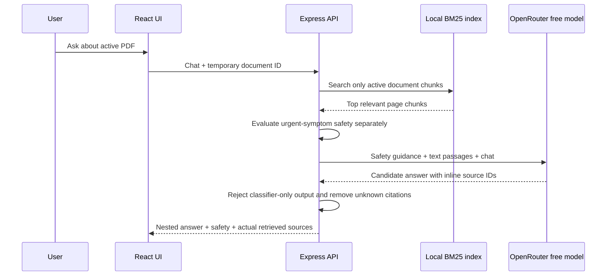

# MediSage Architecture

## PDF upload and summary

## Grounded follow-up

## Security and privacy boundaries

- Free-only model validation happens during configuration and again when building every provider payload.
- Provider failures and invalid classifier-only outputs retry an ordered, bounded fallback list; authentication failures do not retry.
- Safety classification is computed locally and remains a separate response field; it can never replace `data.answer`.
- No OpenRouter request contains a file, file data, parser plugin, embedding request, or search request.
- The OpenRouter key remains in the backend environment.
- The PDF signature, byte size, page count, character count, filename, JSON body, and history length are bounded or validated.
- The original upload buffer is discarded after local extraction.
- Extracted document content stays in process memory until deletion, expiry, eviction, or restart.
- The client receives only relevant excerpts, never the complete extracted document.
- Basic per-IP rate limiting protects all `/api` endpoints.
